# Traffic Sign Detection 
#### Enhancing Road Safety, preparation of road maps, smart city, traffic efficiency


# سامانه هوش مصنوعی تشخیص علائم ترافیکی
#### افزایش ایمنی جاده، تهیه نقشه راه، شهر هوشمند، بهره وری ترافیک

در این مخزن گیت هاب، نسخه ای سبک از پروژه ما برای تشخیص علائم راهنمایی ارائه شده است.

In this git repository a light version of our Traffic Sign Detection project is presented.

نمونه تشخیص (Detection sample):


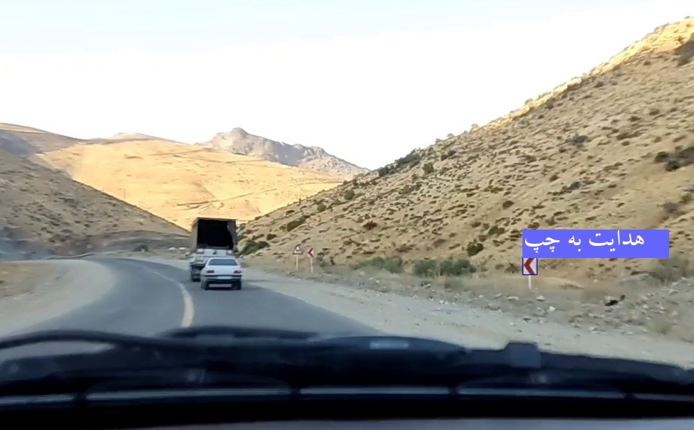


<br/>

کاربردهای این سامانه:

سامانه هوش مصنوعی تشخیص علائم ترافیکی به عنوان یکی از کاربردهای مهم هوش مصنوعی در حوزه مهندسی ترافیک و راهنمایی و رانندگی دارای مزایای زیادی است. کاربردها و مزایا اصلی این سامانه به شرح زیر هستند:

1- ترافیک هوش مصنوعی: این سامانه‌ها به عنوان بخشی از ترافیک هوش مصنوعی و اینترنت اشیاء (IoT) در توسعه شهر هوشمند مورد استفاده قرار می‌گیرند.

2- افزایش ایمنی جاده: سامانه‌های تشخیص علائم ترافیکی به تشخیص دقیق و سریع علائم راهنمایی و رانندگی می‌پردازند. این تشخیص به کاهش تصادفات و حوادث رانندگی کمک می‌کند.

3- کاهش خطاهای انسانی: انسان‌ها ممکن است در برخی مواقع علائم راهنمایی را اشتباه بخوانند یا نادیده بگیرند. سامانه‌های هوش مصنوعی با تشخیص دقیق علائم به خطاهای انسانی پیشگیری می‌کنند.

4- افزایش بهره‌وری ترافیک: با دقیق‌تر شدن رانندگی و رعایت دقیق قوانین ترافیکی، ترافیک بهره‌وری بیشتری خواهد داشت و زمان رانندگی کاهش می‌یابد.

5- تسهیلات رانندگی خودروهای خودکار: در آینده، اتومبیل‌های خودکار به سیستم‌های تشخیص علائم ترافیکی نیاز دارند تا بهترین تصمیم‌ها را برای رانندگی ایمن اتومبیل‌ها بگیرند.

به طور کلی، سامانه هوش مصنوعی تشخیص علائم ترافیکی به بهبود ایمنی و بهره‌وری در محیط‌های حمل و نقل عمومی و شهر هوشمند کمک می‌کند و به کاهش تصادفات و مشکلات ترافیکی می‌انجامد.


# Dataset:

The dataset has been uploaded to Kaggle, and you can download it in the following address:

- https://www.kaggle.com/datasets/barzansaeedpour/traffic-sign-detection

class names:

<!-- <div class="table-responsive">
  <table>
    <thead>
      <tr>
        <th>Label</th>
        <th>Persian</th>
        <th>English</th>
        <th>Image</th>
      </tr>
    </thead>
    <tbody>
      <tr>
        <td>avalin-pich-be-chap</td>
        <td>اولین پیچ به چپ </td>
        <td>first curve to the left</td>
        <td></td>
      </tr>
    </tbody>
  </table>
</div>

<style>
  .table-responsive {
    overflow-x: auto;
  }
  table {
    width: 100%;
    border-collapse: collapse;
  }
  th, td {
    border: 1px solid #ddd;
    padding: 8px;
    text-align: left;
  }
  th {
    /* background-color: #f2f2f2; */
  }
</style> -->

| Label | Persian | English | Image |
|----------|----------|----------|----------|
| avalin-pich-be-chap | اولین پیچ به چپ | first curve to the left | |
| avalin-pich-be-rast | اولین پیچ به راست | first curve to the right | 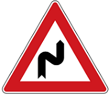 |
| dast-andaz | دست انداز | bump | 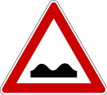 |
| dor-bargardan | دور برگردان | u turn | 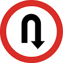 |
| dor-zadan-mamnoe | دور زدن ممنوع | u turn prohebited |  |
| dorbine-sabte-takhalofat | دوربین ثبت تخلفات | speed camera |  |
| faghat-obor-az-chap-mojaz | فقط عبور از چپ مجاز | compulsory keep left | 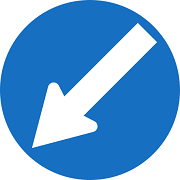 |
| faghat-obor-az-rast-mojaz | فقط عبور از راست مجاز | compulsory keep right | 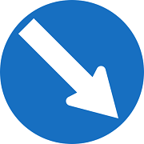 |
| gardesh-be-rast-mamnoe | گردش به راست ممنوع | right turn prohebited | 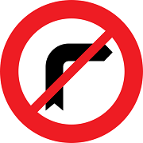 |
| gardesh-be-rast-mamnoe | گردش به چپ ممنوع | right turn prohebited | 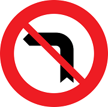 |
| hadeaksar-sorat-mojaz-100 | حداکثر سرعت مجاز 100 | speed limit 100 |  |
| hadeaksar-sorat-mojaz-110 | حداکثر سرعت مجاز 110 | speed limit 110 |  |
| hadeaksar-sorat-mojaz-40 | حداکثر سرعت مجاز 40 | speed limit 40 |  |
| hadeaksar-sorat-mojaz-50 | حداکثر سرعت مجاز 50 | speed limit 50 |  |
| hadeaksar-sorat-mojaz-60 | حداکثر سرعت مجاز 60 | speed limit 60 |  |
| hadeaksar-sorat-mojaz-80 | حداکثر سرعت مجاز 80 | speed limit 80 |  |
| hadeaksar-sorat-mojaz-85 | حداکثر سرعت مجاز 85 | speed limit 85 |  |
| hadeaksar-sorat-mojaz-95 | حداکثر سرعت مجاز 95 | speed limit 95 |  |
| hedayat-be-chap | هدایت به چپ | guide to left |  |
| hedayat-be-rast | هدایت به راست | guide to right |  |
| istadan-mamnoe | ایستادن ممنوع | no stopping or standing | 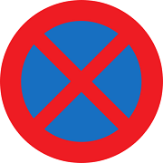 |
| khatar | خطر | danger | 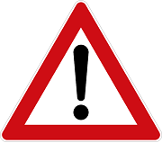 |
| khatare-rizeshe-sang | خطر ریزش سنگ | falling rocks | 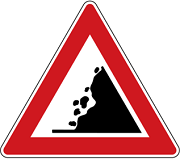 |
| obor-az-har-do-samt-mojaz | عبور از هر دو سمت مجاز | either side | 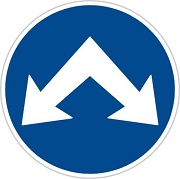 |
| obour-haywanate-ahli | عبور حیوانات اهلی | possibility of cattle on road | 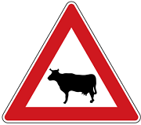 |
| parking | پارکینگ | parking |  |
| pich-be-chap | پیچ به چپ | left turn | 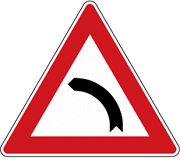 |
| pich-be-rast | پیچ به راست | right turn | 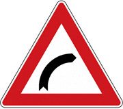 |
| rayate-haghe-taghadom | رعایت حق تقدم | give way | 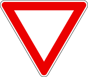 |
| sebghat-azad | سبقت آزاد | overtaking allowed | 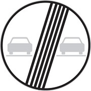 |
| sebghat-mamnoe | سبقت ممنوع | no overtaking | 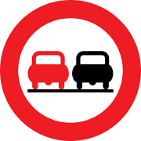 |
| taghatoe | تقاطع | intersection |  |
| voroud-be-rahe-asli-az-chap | ورود به راه اصلی از چپ | side road left | 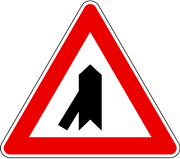 |
| voroud-be-rahe-asli-az-rast | ورود به راه اصلی از راست | side road right | 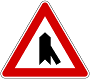 |
| voroud-be-rahe-asli-az-rast2 | ورود به راه اصلی از راست 2 | side road right 2 | 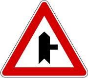 |
| voroud-mamenoe | ورود ممنوع | no entry | 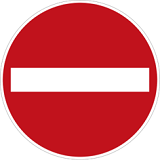 |


# How to use it:

## Method 1:

1- virtual environment setup (windows):

python version: 3.10.0

```
    py -3.10 -m venv env
```

```
    env\Scripts\activate
```

2- install requirements

```
    pip install -r requirements.txt
```

3- Download and unzip the dataset

- https://www.kaggle.com/datasets/barzansaeedpour/traffic-sign-detection

Notice that you should change the train and validation directory in ```data_custom.yaml``` file.

4- Install pytorch CUDA:

- https://pytorch.org/


5- Train yolov8 on the train data:

```
    yolo task=detect mode=train epochs=100 data=data_custom.yaml model=yolov8m.pt imgsz=300 batch=2
```

6- Test the trained model 

```
    yolo task=detect mode=predict model=yolov8m_custom.pt show=False conf=0.4 source=val/images/
```

## Method 2:

Open the notebook in colab:

https://colab.research.google.com/github/barzansaeedpour/Traffic-sign-detection-yolov8/blob/main/TSD_YOLOv8.ipynb


